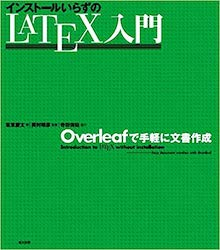

# LaTeXで作るレポート　はじめの１歩

2019/5/15(Wed.) 18:00〜 ＠駒場キャンパス 東大TeX愛好会 domperor

## LaTeXのインストールは済んでいますか（〜18:00）

***おすすめ：『美文書作成入門』付属インストーラ***。書籍部で買いましょう！


- Macの場合：[MacTeX](https://doratex.hatenablog.jp/entry/20190502/1556775026) を使っている人が多い印象。

  本当は TeX Live を```install-tl```した方がよいのだが……

- Windowsの場合：[**あべのりインストーラ**](https://www.ms.u-tokyo.ac.jp/~abenori/soft/abtexinst.html)が便利。

  ただこれでインストールされるのは TeX Live ではなく W32TeX なので TeX Live が必要なら TeX Live を```install-tl```しましょう

- Linuxの場合：頑張って TeX Live を```install-tl``` してください
- インストールが面倒な場合：**Overleaf**を使いましょう

## インストール済みの人は‥‥（18:00〜18:10）

せっかくなのでOverleafを使ってみよう！次の本を買うと詳しくなれる！スクリーンショットふんだんでわかりやすい！！



[↑↑↑寺田先生の新刊ですよ！！宣伝！！↑↑↑](https://www.amazon.co.jp/改訂第7版-LaTeX2ε美文書作成入門-奥村-晴彦/dp/4774187054)

1. まずは[Overleaf](https://www.overleaf.com/)にアクセス

2. registerしてlog in

3. New Project -> Example Project を選択，適当にProject Nameを入れてCreate

4. 日本語を使うための初期設定をしましょう

   - 左上 Menu を押す -> Settings で Compliler を pdfLaTeX から LaTeX にする

   -  Menu ボタンの下の New File から ```latexmkrc``` を作る（拡張子なし）

     ```latexmkrc
     $latex='uplatex';
     $bibtex='upbibtex';
     $dvipdf='dvipdfmx %O -o %D %S';
     $makeindex='mendex -U %O -o %D %S';
     $pdf_mode=3;
     ```

   - main.tex の一行目を次のように変更

     ```変更前
     \documentclass{article}
     ```

     ↓

     ```変更後
     \documentclass[dvipdfmx,uplatex]{jsarticle}
     ```

   - main.tex に日本語をいくつか入れて，Recompileしてみましょう。通るはずです。

5. 参考文献を増やしたいときは references.bib をいじります。

   普通，参考文献を増やした後，反映するためには BibTeX コンパイル -> LaTeXコンパイル２回 が必要なのですが，Overleaf では自動化されていて Recompile １回で反映されます！

6. 出来上がった pdf は Downlad PDF ボタンでダウンロードできる

## オフラインでコンパイルしよう（18:10〜18:20）

Overleaf はよくできているが，Internet Connectivity が必要。オフラインでコンパイルできない，というデメリットがある。自前の環境を用意した方が良いのは間違いない。

1. テキストエディタを用意しよう。**TeXShop** や **TeXWorks** がメジャーか（TeX のインストール時に何かしらついてくることが多い）。テキストエディット.app や メモ帳.exe でも良いが，**TeX 言語専用のテキストエディタ**を使うと

   - シンタックスハイライトが美しくてやりやすい。
   - SyncTeX が使える

2. このゼミの github からテンプレートをダウンロードしましょう（Overleafのやつに揃えてある）

   - template/

     　├  LaTeXtemplate.tex

     　├  references.bib

     　└  universe.jpg

3. 最初のコンパイルを通してみましょう

   - 方法１ ターミナルから（Mac）

     - uplatex，dvipdfmx にパスが通っているとして次のようにすればよい。

       :::templateフォルダまでのpath::: は手打ちせず，ドラッグアンドドロップで打ち込むのがスマート。

       ```ターミナル画面
       cd :::templateフォルダまでのpath:::
       uplatex LaTeXtemplate.tex
       dvipdfmx LaTeXtemplate.dvi
       ```

     - パスが通っていなければ通しましょう

       ```ターミナル画面
       open ~/.profile
       ```

       で .profile をテキストエディットで開き，

       ```.profile
       # これは例
       export PATH="/Applications/TeXLive/texlive/2017/bin/x86_64-darwin:$PATH"
       ```

       のような形で uplatex，dvipdfmx の入っているフォルダまでのパスを通す。

     - また，uplatex と dvipdfmx の２回に分けて通すのが面倒なら ptex2pdf を使うと良い。

       ```ターミナル画面
       cd :::templateフォルダまでのpath:::
       ptex2pdf -u -l LaTeXtemplate.tex
       ```

       `-u` （pLaTeX ではなく upLaTeX）オプションと `-l` （TeX ではなく LaTeX）オプションが必要。

       さらに，`-ot` オプションで SyncTeX を使うと感動できる。

       ```ターミナル画面
       cd :::templateフォルダまでのpath:::
       ptex2pdf -u -l -ot "-synctex=1 -file-line-error -shell-escape" LaTeXtemplate.tex
       ```

       `-ot` オプションは，TeX のオプション引数を書く。詳しくは

       ```ターミナル画面
       tex --help
       ```

       とすると出てくる。

   - 方法２ TeXShop や TeXWorks などからコンパイルを通す

     - TeXShop のときは，「デフォルトのスクリプト（パーソナルスクリプト）」に

       ```LaTeXの欄
       ptex2pdf -u -l -ot "-synctex=1 -file-line-error -shell-escape"
       ```

       と書いておこう。TeXWorks はどこに書くんだろう……

       

     - LaTeXtemplate.tex を開き，タイプセット（Command + T）する。

       

4. BibTeX の反映をしてみよう

   ↑では，BibTeX を走らせていないので，reference の番号が  `?? ` みたいに表示されてしまう。

   - 方法１ ターミナルから（Mac）
     - uplatex，dvipdfmx へのパスを通してあれば，同じ場所で upbibtex へのパスが通っているはず。